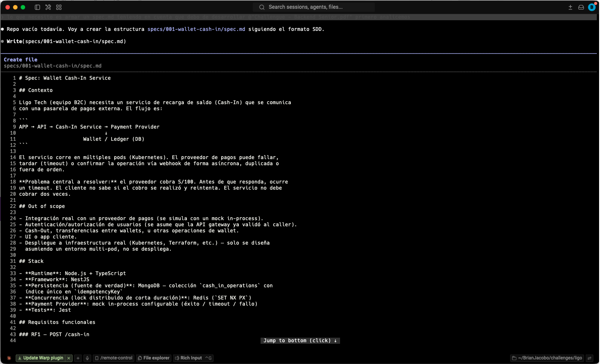
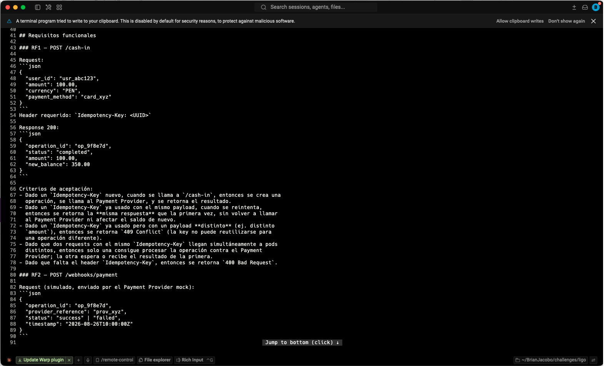
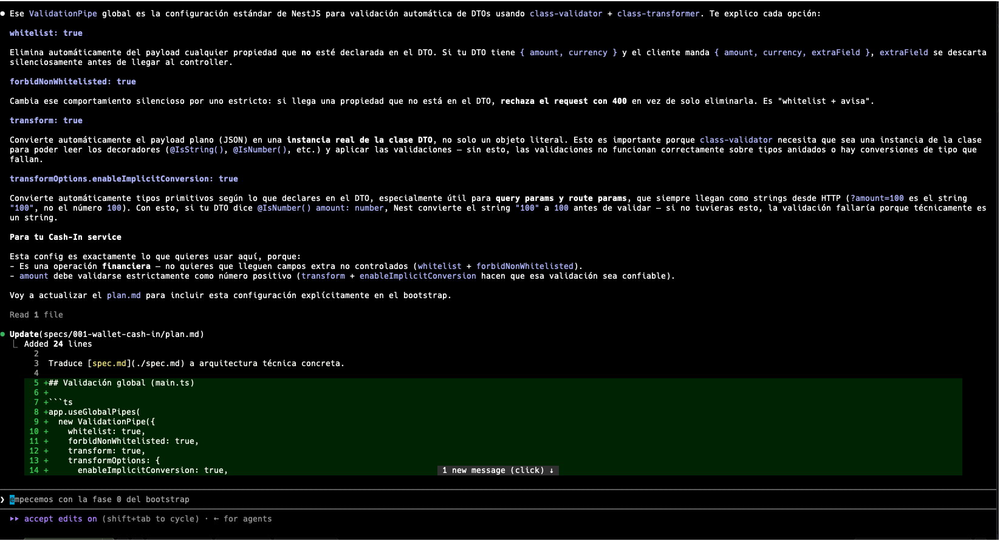
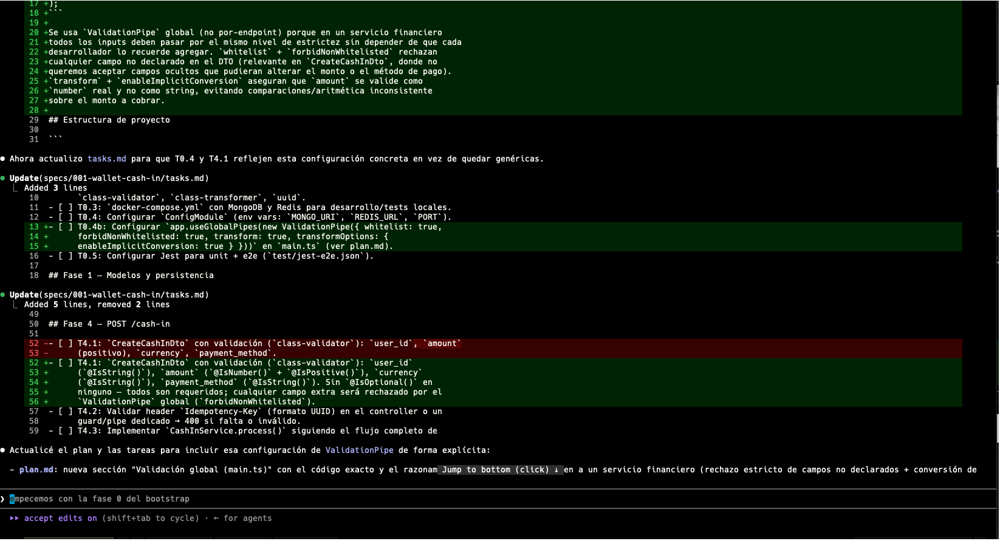
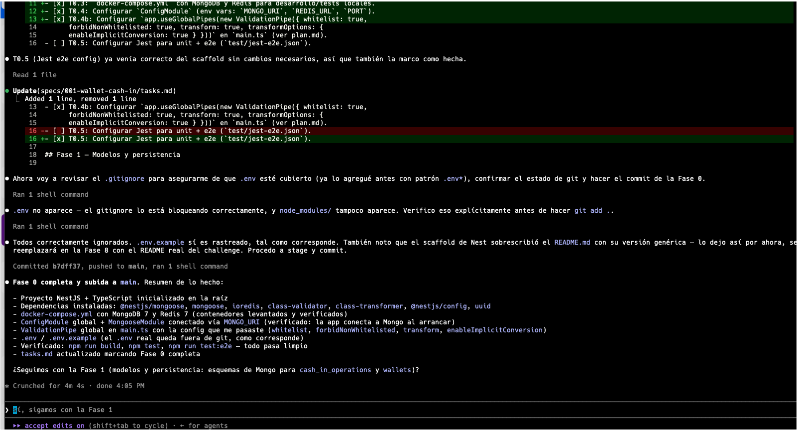
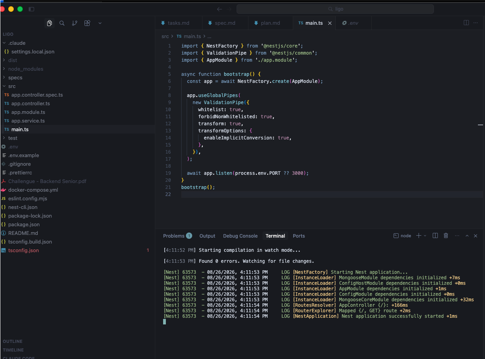

# Wallet Cash-In Service

Servicio de recarga de saldo (Cash-In) para Ligo, construido en NestJS + TypeScript
para el Challenge Técnico Senior Backend. La spec, el plan técnico y el desglose
de tareas están en [specs/001-wallet-cash-in](specs/001-wallet-cash-in/).

## Arquitectura

```
APP → API → Cash-In Service ──┬──► Payment Provider (mock in-process)
                               ├──► MongoDB (fuente de verdad)
                               └──► Redis (lock de concurrencia)

POST /cash-in            ──► CashInService
POST /webhooks/payment    ──► WebhooksService
                               │
                               └──► OperationTransitionService (compartido)
                                     └──► WalletService ($inc atómico)
```

Un módulo por dominio, no por capa técnica: `cash-in`, `webhooks`, `wallet`,
`payment-provider`, `idempotency`, `common` (observabilidad).

## Idempotencia: la garantía real está en Mongo, no en Redis

`cash_in_operations` tiene un **índice único en `idempotencyKey`**. Esa es la
única garantía de "esto se procesa una sola vez" — no una variable en memoria,
no un `Map`, no nada que viva dentro de un solo proceso. El servicio corre en
múltiples pods, así que cualquier mecanismo que no sobreviva a un reinicio o a
otro pod recibiendo la misma request no cuenta como garantía real.

El flujo, resumido:

1. Se calcula un hash del payload (`user_id`, `amount`, `currency`, `payment_method`).
2. Se intenta un lock corto en Redis. Esto es **optimización**, no garantía:
   evita que dos pods llamen al proveedor dos veces durante la ventana de
   carrera, pero no es lo que evita el doble cobro.
3. Si la key ya existe con el mismo hash → se devuelve la respuesta guardada,
   sin tocar el proveedor de nuevo.
4. Si existe con un hash distinto → `409` (la key no puede reusarse para otra
   operación).
5. Si no existe, se inserta en `pending`. Si el insert falla por índice
   duplicado (otro pod ganó la carrera que el lock no cubrió), se relee y se
   trata como si ya existiera.

**Por qué Mongo y no solo Redis:** Redis puede perder datos según su política
de persistencia y no da la semántica de constraint que sí da un índice único.
Mongo es la fuente de verdad; Redis solo acelera el caso común.

## Concurrencia

Dos problemas distintos, dos soluciones distintas:

- **Misma `Idempotency-Key` en paralelo** (doble click, retry, múltiples pods):
  lock de Redis + índice único de Mongo como respaldo, como arriba.
- **Saldo de un mismo usuario actualizado por operaciones legítimas distintas**:
  `WalletService.creditBalance()` usa solo `$inc` atómico, nunca lee-modifica-
  escribe en código de aplicación. Probado con 10 créditos concurrentes al
  mismo wallet — el balance final es la suma exacta.

## Retry

Con idempotencia real, **es seguro reintentar cualquier request con el mismo
`Idempotency-Key`**. Ante un timeout del *proveedor* (no del cliente), la
operación queda en `pending` a propósito — el servicio no asume éxito ni fallo
porque no lo sabe. Nunca reintenta automáticamente contra el proveedor: eso
multiplicaría el riesgo de cobro duplicado del lado externo, que está fuera de
lo que este servicio puede controlar.

## Webhooks

- **Duplicado**: la transición es un update condicional (`{status: "pending"}`
  → nuevo estado). Si ya no está en `pending`, el update no hace nada — sin
  volver a acreditar.
- **Fuera de orden**: mismo mecanismo. `completed` y `failed` son terminales.
- **Llega antes que la operación exista**: se guarda en un buffer
  (`pending_webhooks`, TTL 24h por si la operación nunca llega a crearse).
  `CashInService` revisa ese buffer justo después de insertar la operación y lo
  aplica de inmediato — sin job en background. Si el webhook ya trae el
  resultado, el proveedor ni se llama.

## Manejo de errores de infraestructura

- **Mongo falla al insertar** (no un duplicado, un error real): `503`, nunca
  `200`. El cliente reintenta con el mismo `Idempotency-Key`, es seguro.
- **Redis no responde**: se degrada a operar sin lock, confiando solo en el
  índice único de Mongo. Nunca se cae la request completa por esto.

## Por qué no hay una cola de mensajes

No se usó RabbitMQ/SQS/Pub-Sub. El buffer de `pending_webhooks` resuelve la
única ventana de carrera real (webhook antes que el insert) sin la complejidad
operacional de un broker adicional para un caso que dura milisegundos. Dónde sí
tendría sentido en una siguiente iteración:

- Desacoplar `POST /webhooks/payment` de la transición síncrona (publicar el
  evento, procesarlo en un consumidor aparte).
- Reconciliación periódica de operaciones que quedaron en `pending` sin
  webhook nunca — hoy no implementada, es el siguiente paso lógico.
- Outbox pattern si otro servicio necesitara enterarse de "wallet credited" de
  forma transaccional.

## Observabilidad

Cada request obtiene un `correlationId` (header `X-Correlation-Id` →
`Idempotency-Key` → generado) propagado vía `AsyncLocalStorage`, visible en
todos los logs de esa operación sin pasarlo manualmente entre funciones.
También vuelve en la respuesta como header.

## Setup

Requisitos: Node.js 22+, Docker.

```bash
docker compose up -d              # Mongo + Redis
npm install
cp .env.example .env
npm run start:dev

npm test           # unit
npm run test:e2e   # end-to-end
```

Probar manualmente:

```bash
curl -X POST http://localhost:3000/cash-in \
  -H "Content-Type: application/json" \
  -H "Idempotency-Key: $(node -e 'console.log(crypto.randomUUID())')" \
  -d '{"user_id":"usr_abc123","amount":100,"currency":"PEN","payment_method":"card_xyz"}'
```

`payment_method` especiales del mock: `card_force_timeout`, `card_force_failure`.
Cualquier otro valor simula éxito.

## Uso del agente de IA

### Cómo abordé el problema

Trabajé con **Claude Code y Cursor en paralelo**: Claude Code generó las specs
y el código fase por fase, y tuve Cursor abierto al mismo tiempo para
inspeccionar visualmente el código a medida que se iba generando, en vez de
confiar solo en el resumen que el agente reporta en la terminal.

1. **Spec-driven development.** Antes de escribir código, generé `spec.md`
   (requisitos y criterios de aceptación) y `plan.md` (arquitectura y
   decisiones técnicas) a partir del PDF del challenge. Dejé explícito desde
   el inicio el problema central ("el proveedor cobra, hay timeout, ¿cómo
   evito cobrar dos veces?"), que el proveedor de pago sería un simulador
   interno — un mock in-process, no un servicio HTTP real — y el stack:
   NestJS, MongoDB como fuente de verdad con índice único en `idempotencyKey`,
   Redis como lock de corta duración, Jest para tests.

   
   

2. **Revisión del SDD contra el challenge, antes de ejecutar nada.** Repasé
   cada requerimiento del `spec.md`/`plan.md` generado contra el PDF original
   para confirmar que no faltaba nada y que las decisiones tenían sentido,
   antes de pasar a la fase de tareas.

3. **Ajuste del spec a mitad de camino.** Con specs, plan y tasks ya
   generados, y revisando el código en Cursor antes de que arrancara la
   implementación, decidí agregar una capa de validación estricta que no
   estaba en la primera versión del plan: no quería que llegaran campos no
   controlados en el request (`whitelist` + `forbidNonWhitelisted` en el
   `ValidationPipe` global). Esa decisión se reflejó de vuelta en `spec.md`,
   `plan.md` y `tasks.md` antes de seguir implementando — el spec no quedó
   fijo desde el día uno, se ajustó cuando encontré un requisito que valía la
   pena endurecer.

   
   

4. **Ejecución fase por fase**, revisando cada resultado antes de avanzar
   (bootstrap → modelos → mock del proveedor → lock de idempotencia →
   endpoint de cash-in → webhooks → observabilidad → tests → README →
   revisión final).

   
   

### Decisiones mías, no del agente

- Stack completo, alineado con la posición a la que postulo.
- Mongo como fuente de verdad de idempotencia, Redis como optimización — no al
  revés.
- Mock in-process del proveedor en vez de un servicio HTTP separado, para
  tests determinísticos dado el límite de tiempo.
- Buffer real en Mongo para webhooks tempranos, evaluado explícitamente contra
  la alternativa más simple de solo loguear y descartar.
- No usar una cola de mensajes para este alcance (ver sección arriba).

### Qué generó bien el agente sin corrección

El scaffolding de NestJS, los esquemas de Mongoose, la estructura de módulos,
los DTOs con `class-validator`, y el `findOneAndUpdate` condicional de la
máquina de estados — la pieza más importante del diseño de idempotencia —
salieron correctos a la primera porque el plan ya los había especificado por
completo antes de escribir una línea.

### Qué tuve que corregir yo mismo

Bugs reales, cada uno encontrado por un test que falló o por revisión
explícita — no hipotéticos:

1. **`uuid` incompatible con Jest.** Se agregó en el bootstrap porque es la
   opción por defecto para generar UUIDs en Node. Al llegar al endpoint, rompió
   el build de Jest: `uuid@14` es solo ESM, incompatible con `ts-jest`/CommonJS.
   Reemplazado por `crypto.randomUUID()` nativo — sin el problema, sin
   dependencia extra.
2. **Índice único no garantizado al arrancar.** Mongoose construye índices en
   background y no bloquea escrituras mientras tanto — un pod recién
   arrancado podía aceptar una escritura sin la protección de idempotencia
   activa. Detectado como test intermitente. Corregido esperando
   `ensureIndexes()` de los tres modelos relevantes antes de `app.listen()`.
3. **Aislamiento de tests entre archivos.** Varios `.spec.ts`/`.e2e-spec.ts`
   compartían la misma base de Mongo y el mismo Redis. Como Jest corre cada
   archivo en paralelo, uno podía borrar datos que otro necesitaba a mitad de
   ejecución — pasó dos veces, primero en unit tests, después en e2e.
   Corregido dando a cada archivo/worker su propia base de datos.
4. **`main.ts` y el helper de tests e2e desincronizados.** El `ValidationPipe`
   se copiaba a mano entre ambos; al agregar el interceptor de
   `correlationId`, actualicé uno y no el otro. Corregido extrayendo la config
   compartida a `src/bootstrap.ts`.
5. **El plan documentaba manejo de errores que el código no implementaba.**
   `plan.md` decía "fallo de Mongo → 503" y "fallo de Redis → degradar" desde
   la Fase 1, pero `CashInService` nunca lo hacía — un fallo real de Mongo
   daba `500` genérico, y un fallo de Redis tumbaba toda la request. No lo
   detectó ningún test hasta la revisión final, al repasar los 10 escenarios
   del challenge contra el código real. Corregido distinguiendo el error
   esperado (key duplicada) de cualquier otro fallo de Mongo, y envolviendo el
   `acquire()` de Redis en un try/catch que degrada sin tumbar la request.
6. **`new_balance` podía no reflejar el balance de la propia operación bajo
   concurrencia.** El `$inc` que acredita el saldo ya devuelve el balance
   exacto, pero se descartaba y se hacía una segunda lectura separada después
   — que en teoría podía correr tras otra operación concurrente del mismo
   usuario. El balance en base de datos siempre fue correcto; solo el número
   *reportado en la respuesta* podía no corresponder exactamente a esta
   operación. Encontrado en una auditoría posterior a la Fase 9, no durante el
   desarrollo original. Corregido usando el valor que el `$inc` ya retorna en
   vez de releer.

Los puntos 2, 3, 5 y 6 comparten algo: el código compilaba y hasta pasaba
tests si esos tests no se ejecutaban bajo las condiciones reales (multi-pod,
tests en paralelo, infraestructura caída, concurrencia genuina) que los
exponen. El punto 5 en particular es una lección sobre spec-driven
development — que una decisión esté escrita en el plan no significa que el
código la cumple; hay que verificarlo contra la implementación, no solo
contra la documentación.
